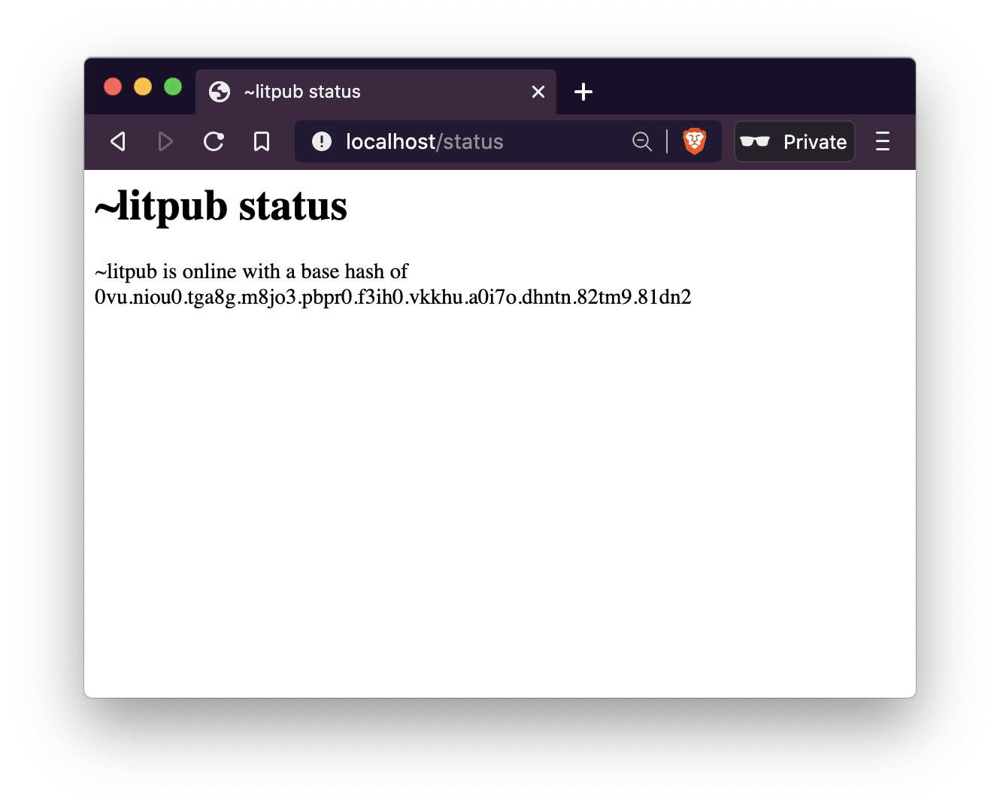

# doppler
A Sail status page for Urbit stars

## Install

1. Place doppler.hoon in the `/home/gen` directory of a mounted %home desk. 

2. Commit with `|commit %home`

3. Serve at a URL with `|serve /status %home /gen/doppler/hoon`